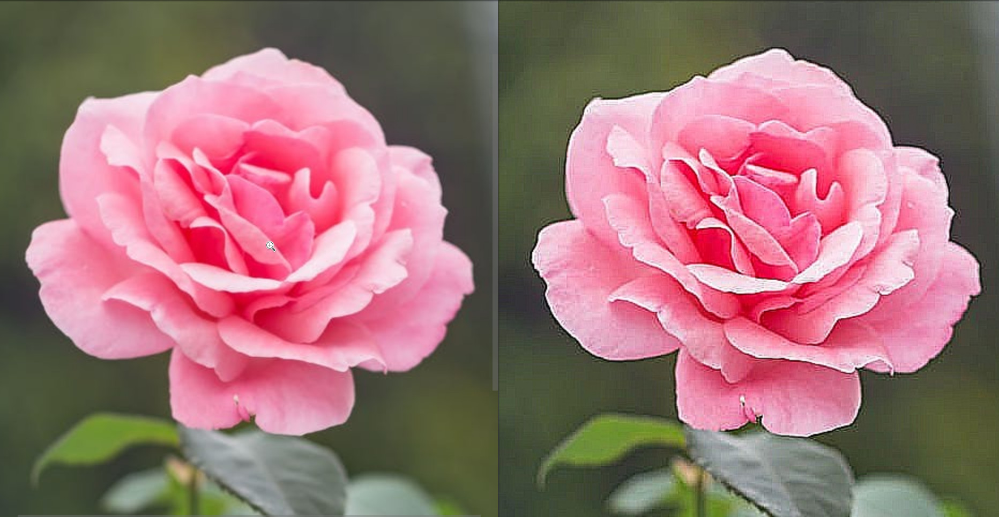
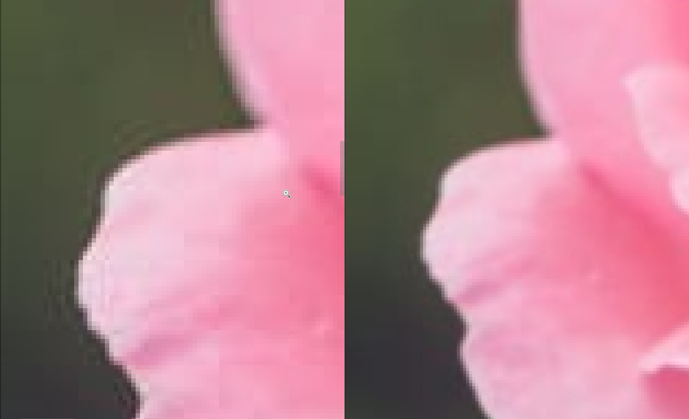
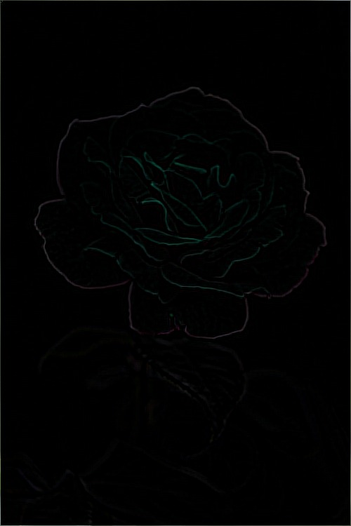
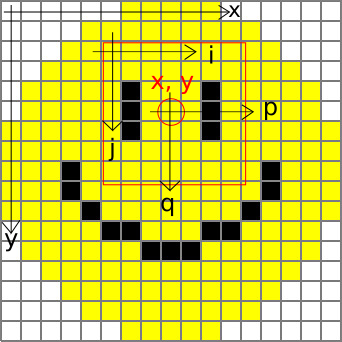

# photoFilters
---
This is a program for manipulating photos by applying a filter. It is implemented in C++, and uses [ImageMagick's](https://imagemagick.org/) API [Magick++](http://www.imagemagick.org/Magick++/). This can be used to improve the quality, by for example sharpening the picture with the `Sharpen` class,

or removing noise or compression artifacts with the `Gaussian` class:

or it can be used to accentuate features of a picture, like with the `Edge` class does for edge detection:

### Theory
A picture of width \(w\) and height \(h\) can be viewed as a function of two coordinates \((x, y)\) which returns values for the red, green and blue channels as a tuple of three numbers, ranging from \(0\) to \(1\),

\[
    pic : [0, h] \times [0, w] \rarr [0, 1]^3
\]

The filter is applied by convolving a funtion, 
 
\[
    f : ( [0, h] \times [0, w] )^ 2 \rarr \mathbb{R}^2,
\]

which in general is a function of the coordinates of the picture, \((x, y)\), and the colors of the points in the vicinity of this points, \((p, q)\). Here, \((p, q)\) are coordinates relativte to \((x, y)\). The "filtered" picture then becomes

\[
    picF(x, y) = \int_{[0, h] \times [0, w]} pic(x, y) \, f(p, q, x, y) \, \mathrm{d}p \, \mathrm{d}q 
\]

A simpel version is whene the filter, \(f\), not is a function of the same coordinates as the orginial picture, \(f(p, q)\). This is what's usually called a [kernel](https://en.wikipedia.org/wiki/Kernel_(image_processing)).

In practice, we have finite resolution, so the problem is discretized so that the image coordinates are integers A picture with a resolution of \(W\)pixels in the width, and \(H\) in the height then becomes a \(W \times H\) matrix, \(pic\), of tuples \((r, g, b)_{x, y}\) with the values for the different color channels rahter than a continous function. The filter can be tought of as an \(M \times N\) matrix _for each_ pixel in the image, espescially in the kernel case, but due to the complexity of this object will I continue to describe it as a function, only with integer arguments:

\[
    f(p, q, x, y), \quad x \in [0, 1 ... W - 1], y \in [0 ... H - 1], p \in [0, ... N - 1], q \in [0 ... M - 1]
\]

The filterd channel values is then found by a sum instead of an integral, so that the red, filtered value in the pixel \(x, y\) is

\[
    rF_{x, y} = \sum_{q = 0} ^ {M - 1} \sum_{p = 0} ^ {N - 1}  \, f(p, q, x, y) \, r_{x, y},
\]

and likewise for the other elements of the tuple \((rF, gF, bF)_{x, y}\), which is an element for the final, filtered picture, represented by a new \(W \times H\) matrix \(picF\).

### Implementation

The matrices containing the pictures are implemented by using the Magick++ class`Image`. The filter is represented by a class. A base class `Filter` is a filter with the identity function,

\[
    f(p, q, x, y) = 
    \begin{cases}
        1, (p, q) = (0, 0)\\
        0, \text{elsewhere},
    \end{cases}
\]

as a virtual member function. All other filters are derived classes, overwirting the virtual function `f`. 

### Coordinates
\((x, y)\) is used as the coordinates of the image, \((i, j)\) are coordinates relative to a pixel, and are used to gather information from the enviorment of that pixel to change it when the filter is applied. \((p, q)\) are shifted so that the pixel \((x, y)\) is in the origo, so that while \(i\) and \(j\) ranges from \(0\) to \(M\) and \(0\) to \(N\), is the range of \(p\) and \(q\) is between \(-m\) and \(m\), and \(-n\) and \(n\), where \( 2 m + 1 = M, \, 2 n + 1 = N \). \(x, \, p, \, i\) goes horizontally, while \(y, \, q, \, j\) goes vertcally.

